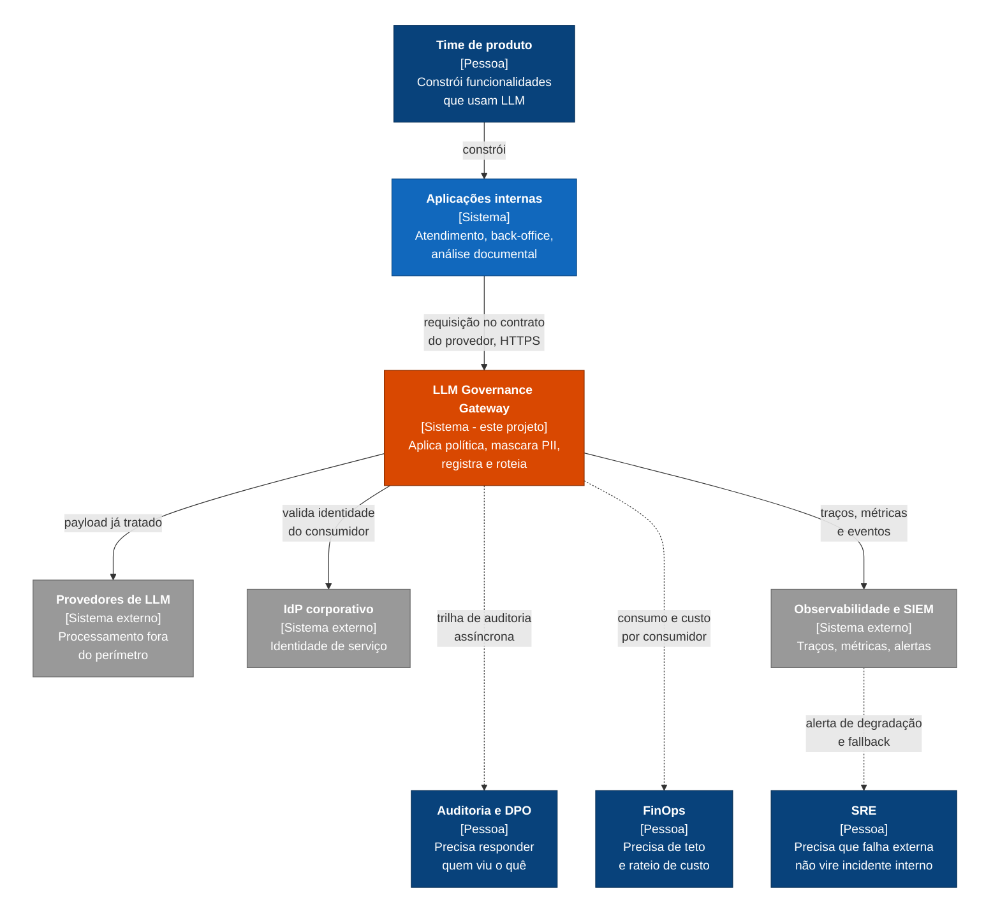

# C4 Nível 1: Contexto

Quem usa o gateway, com o que ele conversa e onde ficam as fronteiras.

O diagrama abaixo usa Mermaid para renderizar direto no GitHub. A fonte canônica,
em Structurizr DSL, está em [`workspace.dsl`](workspace.dsl).

## O que o nível 1 revelou

O gateway tem **quatro públicos, não um**. O time de produto é apenas o que faz a
chamada. Auditoria, FinOps e SRE nunca tocam no sistema e ainda assim definem a maior
parte dos requisitos não funcionais.

A consequência entrou direto na arquitetura: três dos quatro públicos consomem
**saída assíncrona** (trilha, custo, alerta). Nenhum deles pode estar no caminho
síncrono da requisição. Isso justifica o serviço de auditoria separado, registrado em
[ADR-0001](../adr/0001-decomposicao-em-tres-servicos.md).

## Fronteira de confiança

A única seta que cruza o perímetro da organização é a do gateway para o provedor de
LLM. É por isso que o mascaramento de PII acontece nesse ponto e não dentro da
aplicação: um único lugar para inspecionar, um único lugar para auditar.

## Fora do contexto, de propósito

Base vetorial, orquestrador de agentes e ferramentas de avaliação de resposta não
aparecem. O gateway é infraestrutura de passagem, não plataforma de IA.
